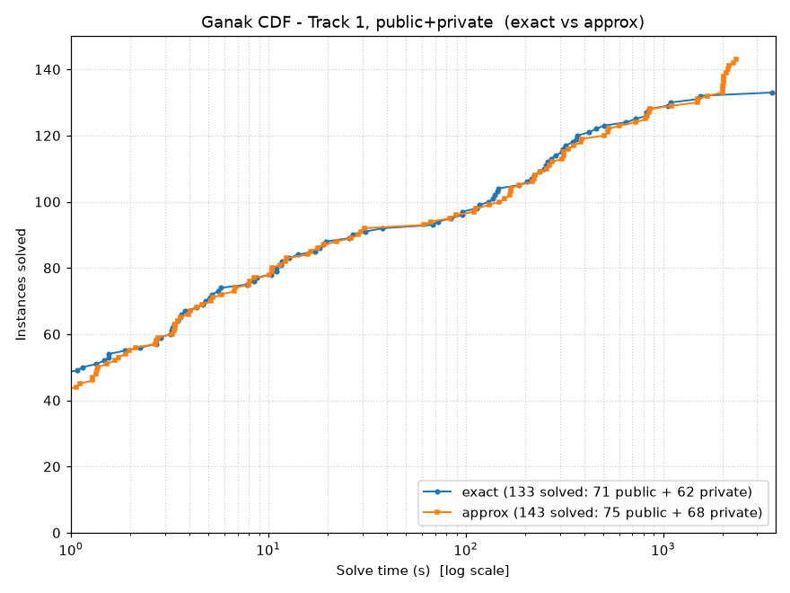
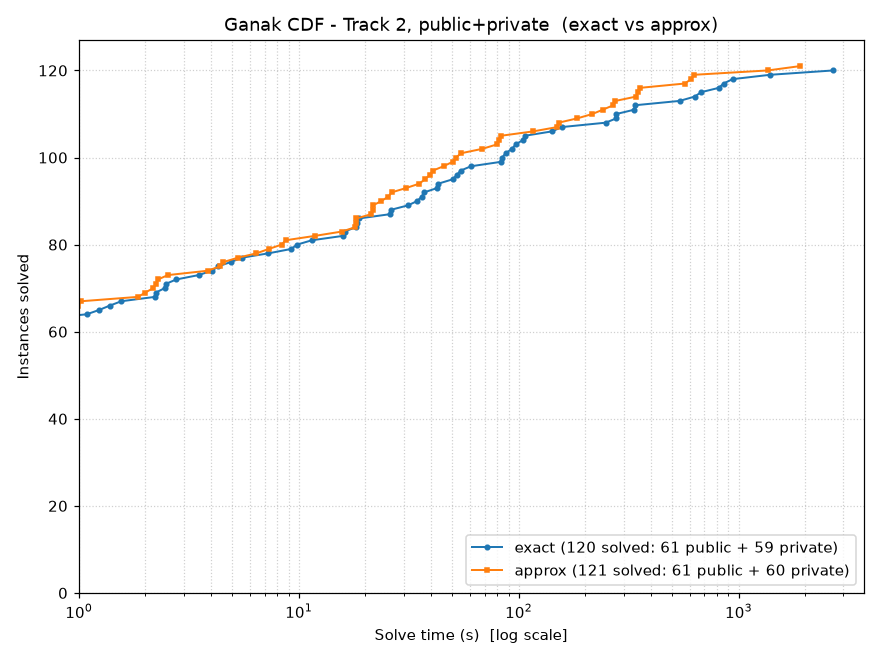
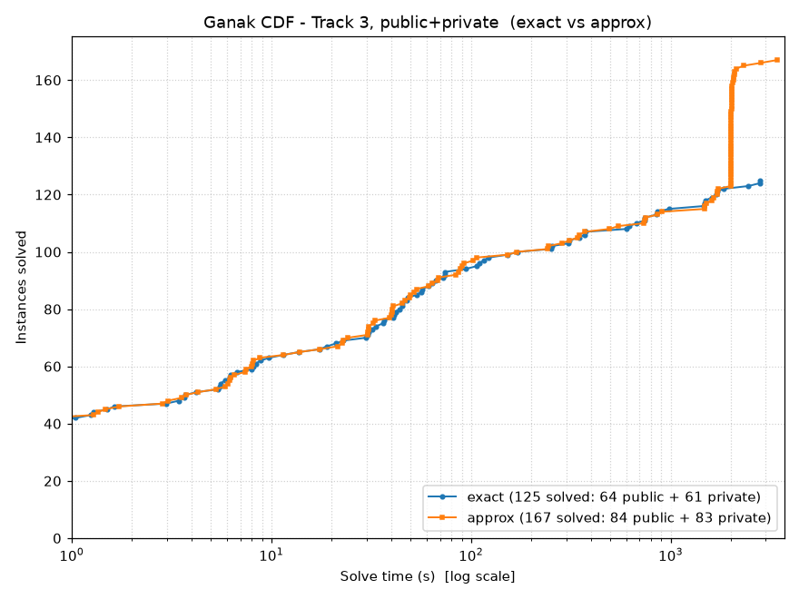
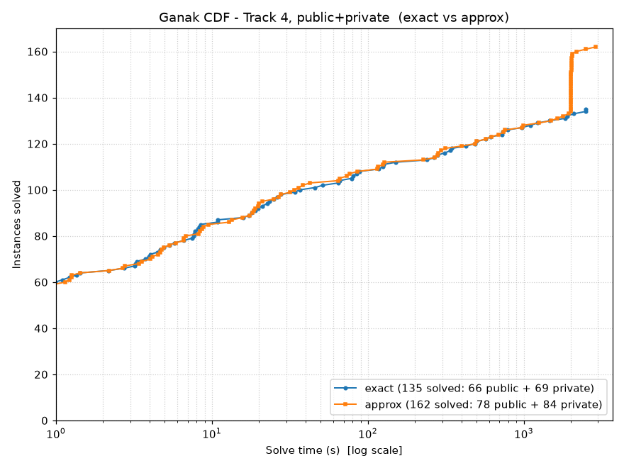
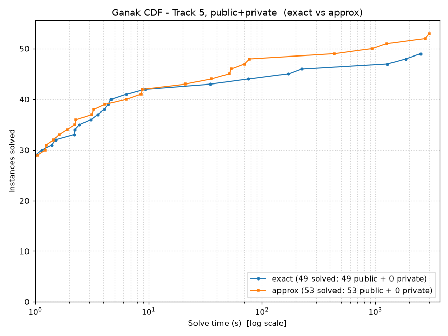

# Ganak at the model counting competition 2026

## Building

Should build with `./build.sh`. It simply unpacks and builds gmp, mpfr, and flint and then
sets up all the build shell scripts for our self-managed tools, and then builds them all.
This results in a statically linked binary `ganak_static`.

## Run scripts

*  `mccomp_run_approx.sh` -- runs with approximate model counting for
   unweighted, and runs with high precision floating point for weighted counting
*  `mccomp_run_exact.sh` -- runs with exact model counting for unweighted, and
   runs with infinite precision rational numbers for weighted
*  `mccomp_run_fast.sh` -- runs tuned to 5 minute time limit. Runs with exact
   model counting for unweighted, and high precision floating point for
   weighted counting

## Results

CDF (cactus) plots of solve time over the public+private instance sets combined,
generated by `scripts/create_cdf-all.py` into `cdf_plots-all/`. The x axis is wall
clock time in seconds (log scale, 3700s limit), the y axis is the number of
instances solved. Each plot compares the two configurations, "exact" and "approx".

**What "approx" means.** It depends on the track:

*  **Track 1 and 3 only:** "approx" means **PAC** -- probabilistically approximate
   counting, i.e. the count is within a multiplicative epsilon of the true count
   with probability at least 1-delta.
*  **All other tracks:** "approx" means **high precision floating point (MPFR)**.
   The corresponding "exact" run
   uses **infinite precision rationals (MPQ)** instead.

**Why the floating point runs are risky.** With MPFR the error can be an *absolute*
error when the value is supposed to be zero, **not** a relative/percentage one,
In other words, **zero cannot be guaranteed**: an instance whose true weighted count
is exactly 0 can be reported as a small NON-ZERO value. Only the MPQ ("exact")
runs give an answer you can trust for such cases.

### Track 1 -- Model Counting (mc)

Here "approx" is **PAC**: a probabilistically approximate count, within a
multiplicative epsilon with probability 1-delta. "exact" is the exact model count.

| Configuration | Public | Private | Total |
|---|---|---|---|
| exact  | 71 / 100 | 62 / 100 | 133 / 200 |
| approx | 75 / 100 | 68 / 100 | 143 / 200 |

### Track 2 -- Weighted Model Counting (wmc)

Here "approx" does **not** mean PAC. It means high precision floating point
(MPFR), while "exact" means infinite precision rationals (MPQ). The MPFR error is
absolute, not percentage-based, hence unbounded, and a true count of 0 can be
reported as non-zero.

| Configuration | Public | Private | Total |
|---|---|---|---|
| exact  | 61 / 100 | 59 / 100 | 120 / 200 |
| approx | 61 / 100 | 60 / 100 | 121 / 200 |

### Track 3 -- Projected Model Counting (pmc)

Here "approx" is **PAC**: a probabilistically approximate count, within a
multiplicative epsilon with probability 1-delta. "exact" is the exact model count.

| Configuration | Public | Private | Total |
|---|---|---|---|
| exact  | 64 / 100 | 61 / 100 | 125 / 200 |
| approx | 84 / 100 | 83 / 100 | 167 / 200 |

### Track 4 -- Projected Weighted Model Counting (pwmc)

Here "approx" does **not** mean PAC. It means high precision floating point
(MPFR), while "exact" means infinite precision rationals (MPQ). The MPFR error is
absolute, not percentage-based, hence unbounded, and a true count of 0 can be
reported as non-zero.

| Configuration | Public | Private | Total |
|---|---|---|---|
| exact  | 66 / 100 | 69 / 100 | 135 / 200 |
| approx | 78 / 100 | 84 / 100 | 162 / 200 |

### Track 5 -- Complex-Weighted Model Counting (amc-complex)

Public instances only, no private set. Here "approx" does **not** mean PAC. It
means high precision floating point (MPFR), while "exact" means infinite precision
rationals (MPQ). The MPFR error is absolute, not percentage-based, hence
unbounded, and a true count of 0 can be reported as non-zero -- which matters a
lot here, since complex-weighted counts cancel to exactly zero often.

| Configuration | Public | Private | Total |
|---|---|---|---|
| exact  | 49 / 100 | n/a | 49 / 100 |
| approx | 53 / 100 | n/a | 53 / 100 |

